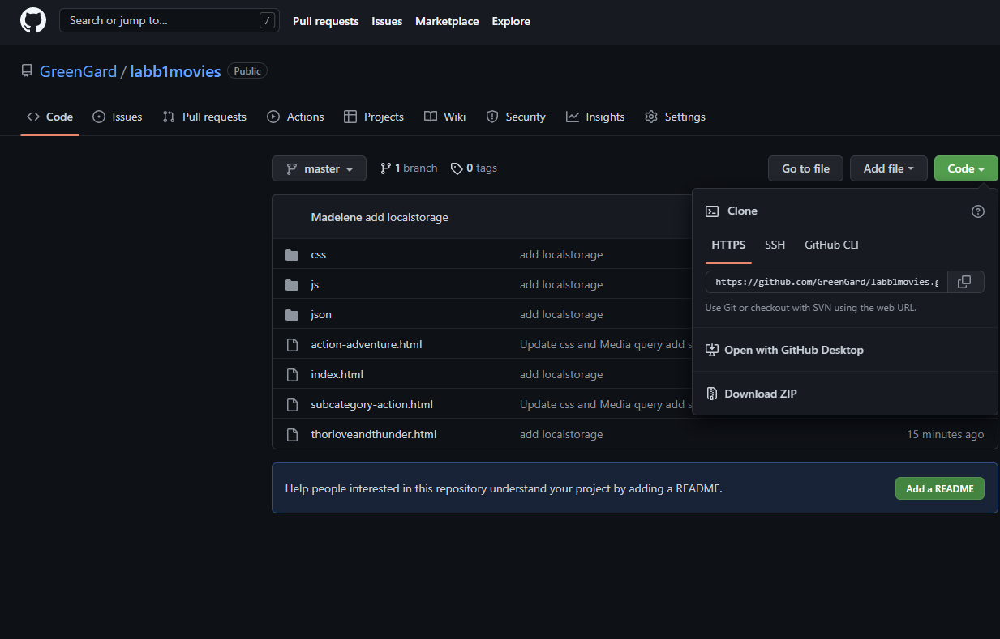
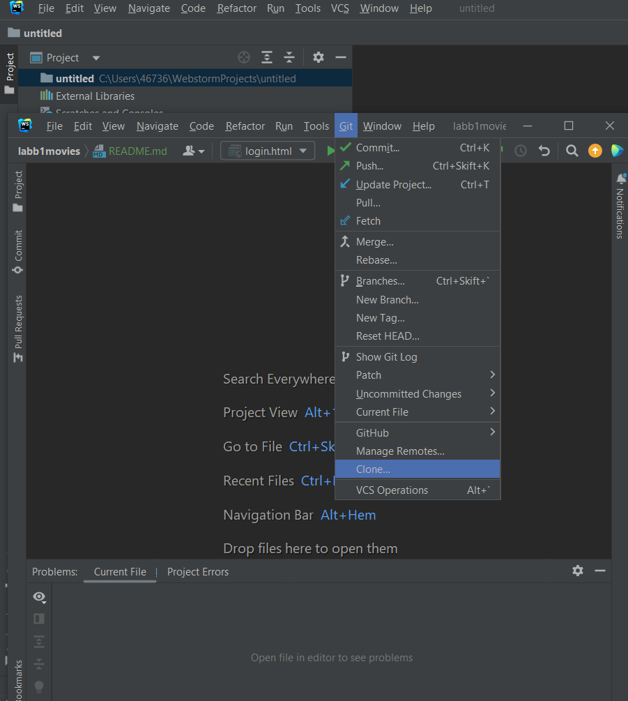
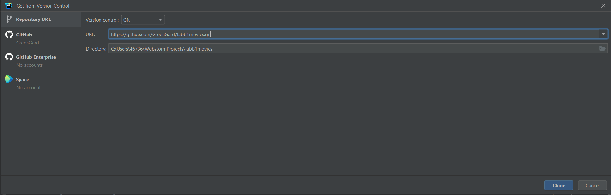

# Labb1Movie

## Usage

Use an Editor like:

• WebStorm (JetBrains)
• Visual Studio Code
• Atom, sublime text

Clone this project via GitHub

or just copy the URL https://github.com/GreenGard/labb1movies.git 

Create a new project, click Git and Clone. 

add the URL for this repository

You now have access to Labb1Movie!

## About:

### Index.html will present a navbar , some pictures, and the top five movies (Top 5 bästa filmerna) according to this site. (JSON document)

-Click on Action and choose UNDERGENRE 

### subcategory-action.html 
-presenting different subcategories for category:Action

-Click ACTION-ÄVENTYR

### action.adventure.html 
-will show movies which belong to the subcategory.

-Click on the first picture to read more about the movie, you can watch a YouTube clip with Iframe, and leave your own rating-presented at webpage when click :button "Klicka för dina poäng".

